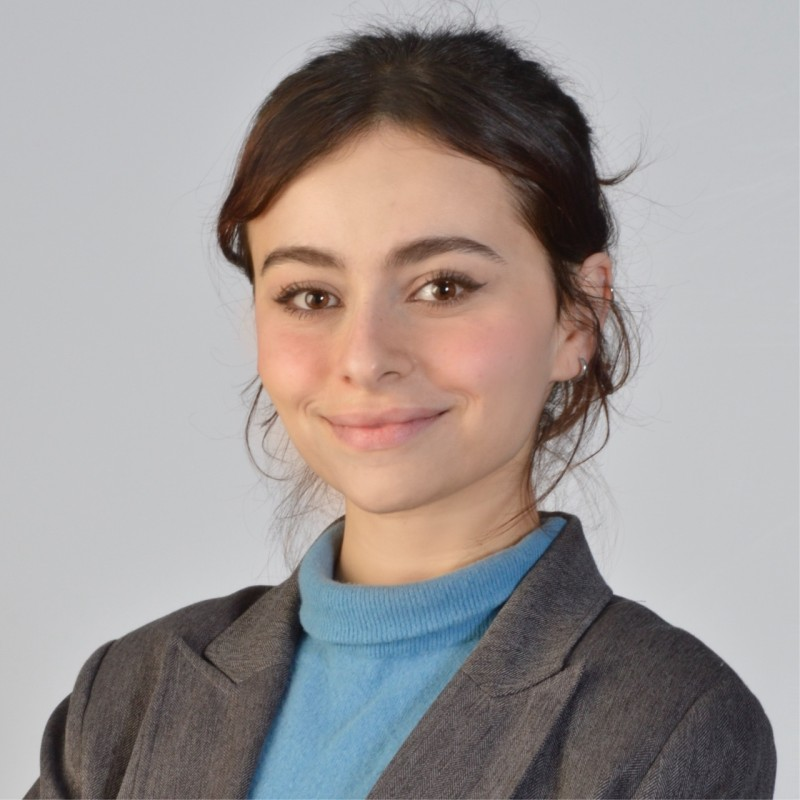

# Lina Berrayana — Researcher in Machine Learning

{width="180" style="border-radius:12px; float:right; margin-left:18px;}

Contact: [lina.berrayana@epfl.ch](mailto:lina.berrayana@epfl.ch) • [LinkedIn](https://www.linkedin.com/in/lina-berrayana-431046257/) • [GitHub](https://github.com/LSIR/llm-mediator-simulation/tree/debateSim)

---

I am a Master's student in Data Science at EPFL working on reasoning and planning with generative models. My work focuses on discrete diffusion models, collaboration between latent and autoregressive systems, and evaluation methods for robust and interpretable LLM behavior.

This repository hosts a lightweight personal site. For a prettier view, open `index.html` (included) or visit the GitHub Pages site if enabled.

## Quick links

- Homepage: `index.html` (styled)  
- CV / photo: `cvpicture.jpg` (if present)  
- Selected publications and preprints (see Publications section below)

## Selected publications

- Planner and Executor: Collaboration between Discrete Diffusion and Autoregressive Models in Reasoning — Lina Berrayana et al. (submitted to ICLR 2026). [arXiv](https://arxiv.org/abs/2510.15244)
- Are Bias Evaluation Methods Biased? — Lina Berrayana et al., ACL 2025 (GEM Workshop). [arXiv](https://arxiv.org/abs/2506.17111)

## Recent experience (high level)

- Research Intern — Microsoft Research Beijing (2025): theoretical and applied work on masked discrete diffusion in planning frameworks.  
- Research Intern — ETH Zurich (2025): collaboration between discrete diffusion and autoregressive models for reasoning tasks.  
- Machine Learning Engineer Intern — IBM Research Zurich (2025): evaluation systems and agentic LLM reliability.

## Other Activities

- **Cultural Exploration:** I have lived in Europe (Switzerland, France), Africa (Tunisia), Asia (China, Japan), and America (United States during early childhood), which has broadened my perspective and appreciation for diverse cultures.  

- **Creativity:** I enjoy making music and writing poetry, activities I find closely related to research : both require curiosity, experimentation, and iteration. In 2022, I released an EP with a French label [RedPalm](https://songstats.com/artist/sp7o12iy/redpalm).  

- **Dance & Sports:** I practiced ballet for 8 years, developing discipline and focus, and I enjoy a variety of sports to maintain an active and balanced lifestyle.  

- **Challenges & Hackathons:** I love tackling challenges and have participated in multiple hackathons. At 15, I won my first hackathon at a startup competition hosted by EPT (the first university of Tunisia) as the youngest participant, and recently earned second prize in the Microsoft Switzerland Hackathon (2025).

For a full CV-style listing, see the `index.html` homepage in this repo.

---

If you'd like layout or content changes on the site (colors, fonts, sections), tell me which style you prefer (minimal, academic, or modern) and I can iterate.

> "Curiosity is the most powerful catalyst for discovery."
